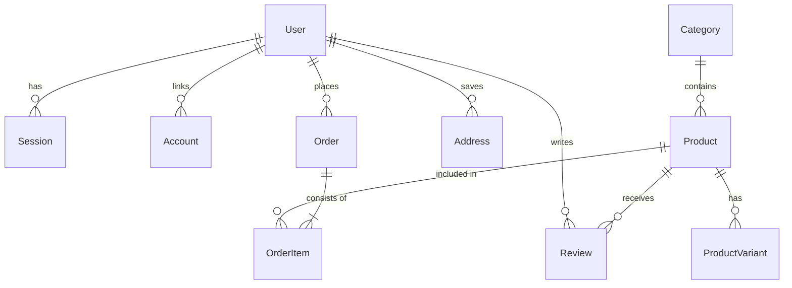

# 🏛️ Architecture & Roadmap Documentation — Ellora

This document provides a comprehensive technical overview of **Ellora**, a modern, high-performance full-stack E-Commerce platform built with Next.js 16, React 19, Prisma ORM, MongoDB, Better Auth, and Razorpay.

---

## 📐 1. System Architecture Overview

Ellora adopts a modular, domain-driven layered architecture leveraging Next.js 16 App Router for Server Components (RSC), API routes, and Server Actions.

```
┌─────────────────────────────────────────────────────────────────┐
│                        Client Layer                             │
│  React 19 Components • Tailwind CSS v4 • Radix UI • Lucide UI   │
└────────────────────────────────┬────────────────────────────────┘
                                 │ HTTP / Web APIs
┌────────────────────────────────▼────────────────────────────────┐
│                    Next.js 16 App Router                        │
│  Server Components • API Routes (/api/*) • Server Actions       │
└──────┬─────────────────────────┬─────────────────────────┬──────┘
       │                         │                         │
┌──────▼──────────┐     ┌────────▼──────────┐     ┌────────▼──────────┐
│ Authentication  │     │ Business Services │     │ Payment & Sync    │
│  Better Auth    │     │ Order, Product,   │     │ Razorpay SDK      │
│ (OAuth / Pass)  │     │ Category, Review  │     │ Shopify Storefront│
└──────┬──────────┘     └────────┬──────────┘     └────────┬──────────┘
       │                         │                         │
       └─────────────────────────┼─────────────────────────┘
                                 │
                        ┌────────▼────────┐
                        │   Prisma ORM    │
                        └────────┬────────┘
                                 │ MongoDB Native Driver
                        ┌────────▼────────┐
                        │  MongoDB Atlas  │
                        └─────────────────┘
```

---

## 📁 2. Modular Codebase Structure

The codebase adheres to strict separation of concerns, grouping business capabilities into service modules and feature slices:

```
Ellora/
├── prisma/
│   ├── schema.prisma          # Database models (Users, Products, Orders, Reviews, etc.)
│   └── seed.ts                # Database seeder script
├── src/
│   ├── app/                   # Next.js App Router routes & API endpoints
│   │   ├── api/               # Server-side API endpoints (REST)
│   │   │   ├── auth/          # Better Auth endpoints
│   │   │   ├── cart/          # Cart management endpoints
│   │   │   ├── orders/        # Order management & history
│   │   │   ├── products/      # Product catalog API
│   │   │   ├── razorpay/      # Payment creation & verification
│   │   │   └── reviews/       # Review submission & retrieval
│   │   ├── cart/              # Shopping cart page
│   │   ├── checkout/          # Multi-step checkout pipeline
│   │   ├── login/ & register/ # Auth user views
│   │   ├── orders/            # Order history view
│   │   └── products/          # Product details & catalog pages
│   ├── components/            # Shared UI components (Navbar, Footer, Modals)
│   ├── context/               # Global state providers (Cart Context, Theme Provider)
│   ├── features/              # Feature modules (Auth, Checkout, Products)
│   ├── hooks/                 # Custom React hooks (useRazorpayPayment, useCart)
│   ├── lib/                   # Singletons & utilities (Prisma client, Better Auth, Razorpay)
│   ├── services/              # Encapsulated Business Services
│   │   ├── category.service.ts
│   │   ├── order.service.ts
│   │   ├── product.service.ts
│   │   ├── review.service.ts
│   │   └── shopify.service.ts
│   ├── types/                 # Shared TypeScript interfaces & types
│   └── validations/           # Zod schema validation rules
```

---

## 🔄 3. Core Technical Workflows

### 3.1 Authentication & Session Management
- **Provider**: Powered by [Better Auth](https://www.better-auth.com/).
- **Methods**: Supports standard email/password authentication and Google OAuth.
- **Session Handling**: Session tokens are cryptographically generated, persisted in the MongoDB `sessions` collection, and passed via secure HTTP-Only cookies.

### 3.2 Order & Checkout Payment Flow
```
[ Client Cart ] ──1. Initiate Checkout──> [ /api/orders ]
                                               │
                                       2. Create Order (Status: PENDING)
                                               │
                                               ▼
[ Razorpay SDK ] <──3. Razorpay Order ID── [ /api/razorpay/create-order ]
       │
4. Open Modal & Process Payment
       │
       └──5. Callback Payload──> [ /api/razorpay/verify ]
                                       │
                               6. HMAC SHA-256 Signature Verification
                                       │
                                       ▼
                              [ Update Order: CONFIRMED, Payment: PAID ]
```

---

## 🗄️ 4. Data Architecture & Entity Relationship

Ellora uses MongoDB Atlas as its primary document store, abstracted through Prisma ORM v6.



---

## 🗺️ 5. Development Roadmap & Future Phases

```
┌────────────────────────────────────────────────────────────────────────────────┐
│ PHASE 1: Core Storefront & Payment Engine (CURRENT)                            │
├────────────────────────────────────────────────────────────────────────────────┤
│ PHASE 2: Merchant Portal, Inventory & Logistics Pipeline                       │
├────────────────────────────────────────────────────────────────────────────────┤
│ PHASE 3: AI Personalization, Semantic Search & Real-Time Analytics             │
├────────────────────────────────────────────────────────────────────────────────┤
│ PHASE 4: Global Scale, Multi-Tenant Ecosystem & Native Mobile Apps            │
└────────────────────────────────────────────────────────────────────────────────┘
```

### ✅ Phase 1: Core Storefront & Checkout Architecture (Current Base)
- [x] **Next.js 16 App Router & Server Components**: Core web framework setup.
- [x] **Database & ORM Integration**: MongoDB cluster paired with Prisma ORM 6 schema definitions.
- [x] **Better Auth Integration**: Credentials auth, Google OAuth, and secure session management.
- [x] **Product Catalog & Variant System**: Categories, product detail views, dynamic inventory, and customer reviews.
- [x] **Reactive Cart & Checkout**: Cart context management, multi-step checkout form, and address management.
- [x] **Razorpay Payment Gateway**: Integration with client modal overlay and server-side HMAC signature verification.
- [x] **Shopify Sync Engine**: CLI tools for importing Shopify Storefront products and collections.

---

### 🚀 Phase 2: Merchant Portal, Order Logistics & Discount Engine (Next Phase)

Focuses on administrative capabilities, warehouse logistics, order fulfillment, and marketing engines.

#### 1. Admin & Merchant Dashboard (RBAC)
- **Role-Based Access Control (RBAC)**: Roles (`ADMIN`, `STORE_MANAGER`, `SUPPORT`, `CUSTOMER`) with middleware route protection.
- **Admin Control Panel**: Interface for managing catalog items, stock updates, user accounts, and order processing.
- **Order Pipeline Workflow**: Transition orders through granular states (`PENDING` ➔ `CONFIRMED` ➔ `PROCESSING` ➔ `SHIPPED` ➔ `DELIVERED` ➔ `CANCELLED` / `REFUNDED`).

#### 2. Advanced Stock & Inventory Management
- **Stock Reservation**: Temporary inventory lock during active checkout (15-minute reservation timer) to prevent overselling.
- **Low-Stock Alerts**: Automated dashboard alerts and webhooks when inventory drops below specified thresholds.
- **Multi-Variant Mass Import/Export**: CSV/JSON bulk product upload and sync.

#### 3. Logistics & Automated Customer Communication
- **Courier API Integrations**: Integration with shipping aggregators (e.g., Shiprocket, Delhivery, FedEx API) for label generation and tracking URL creation.
- **Transactional Notifications**: Automated email & WhatsApp status updates (via Resend & Twilio) for order placement, shipment tracking, and delivery confirmation.

#### 4. Promo, Coupon & Discount Engine
- **Promo Code Engine**: Flexible coupon management (percentage off, fixed amount, free shipping, minimum cart total requirements).
- **Automated Sales Rules**: Scheduled category-wide discounts and flash sale pricing overrides.

---

### 🤖 Phase 3: AI-Driven Personalization, Smart Search & BI Analytics

Focuses on intelligence, discovery, customer retention, and deep analytics.

#### 1. Semantic Search & Discovery
- **Vector Search Integration**: Implementation of MongoDB Atlas Vector Search / Algolia / Typesense for instant, typo-tolerant full-text search.
- **Visual Product Search**: Image-based similarity search allowing users to upload product images to find matching catalog items.

#### 2. AI Shopping Assistant ("Ellora AI")
- **LLM Concierge Agent**: Conversational AI assistant for product discovery, fit/size suggestions, product comparisons, and customer support.
- **Automated Review Insights**: AI summarization of user reviews highlighting key pros and cons for each product.

#### 3. Personalization & Recommendation Engine
- **"Frequently Bought Together" & Cross-Sell**: Collaborative filtering model recommending complementary products during cart review.
- **Dynamic Personalized Homepage**: User-tailored product recommendation feeds based on past viewing history and purchase behavior.

#### 4. Advanced Merchant BI & Predictive Analytics
- **Financial Analytics Dashboard**: Visual charts for Gross Revenue, Net Margin, Average Order Value (AOV), and Customer Lifetime Value (LTV).
- **Abandoned Cart Recovery**: Automated email retargeting triggers for users who abandon checkout sessions.

---

### 🌐 Phase 4: Global Scale, Multi-Tenant Ecosystem & Native Mobile Apps

Focuses on global expansion, multi-vendor support, and mobile expansion.

#### 1. Global Commerce & Localization (i18n)
- **Multi-Currency Engine**: Real-time currency conversion rates (INR, USD, EUR, GBP) with geo-IP targeting.
- **Internationalization (i18n)**: Localization of currency formats, dates, and localized language UI strings.
- **Global Tax & Tariff Calculation**: Automated region-specific tax calculations (GST, VAT, US Sales Tax).

#### 2. Multi-Tenant / Multi-Vendor Marketplace
- **Seller Onboarding & Portals**: Dedicated seller dashboards for independent merchants to list items, view earnings, and manage fulfillment.
- **Split Order Engine**: Automatic splitting of multi-vendor carts into separate orders with automated commission distribution via Razorpay Route.

#### 3. Native Cross-Platform Mobile Applications
- **React Native / Expo Apps**: iOS and Android native mobile applications utilizing shared TypeScript interfaces, services, and API hooks from the core web repository.
- **Mobile Push Notifications**: Target push notifications for promotional campaigns and order updates.

#### 4. Headless Commerce API & Developer Ecosystem
- **Public REST & GraphQL Gateway**: Secure developer API endpoints with rate-limiting and API key management.
- **Webhook Subscriptions**: Enable external systems (ERPs, CRMs, custom inventory software) to listen to store events (`order.created`, `stock.updated`).

---

## 🔒 6. Security & Compliance Architecture

- **Data Integrity**: All request payloads are strictly validated using `Zod` schemas before reaching service layers.
- **Payment Verification**: Mandatory server-side HMAC SHA-256 signature verification for Razorpay payment webhooks/callbacks.
- **Authentication**: Password hashing via argon2/bcrypt in Better Auth; session tokens stored as HTTP-Only, SameSite cookies.
- **CORS & Headers**: Next.js security headers (CSP, HSTS, X-Frame-Options) configured in `next.config.ts`.
